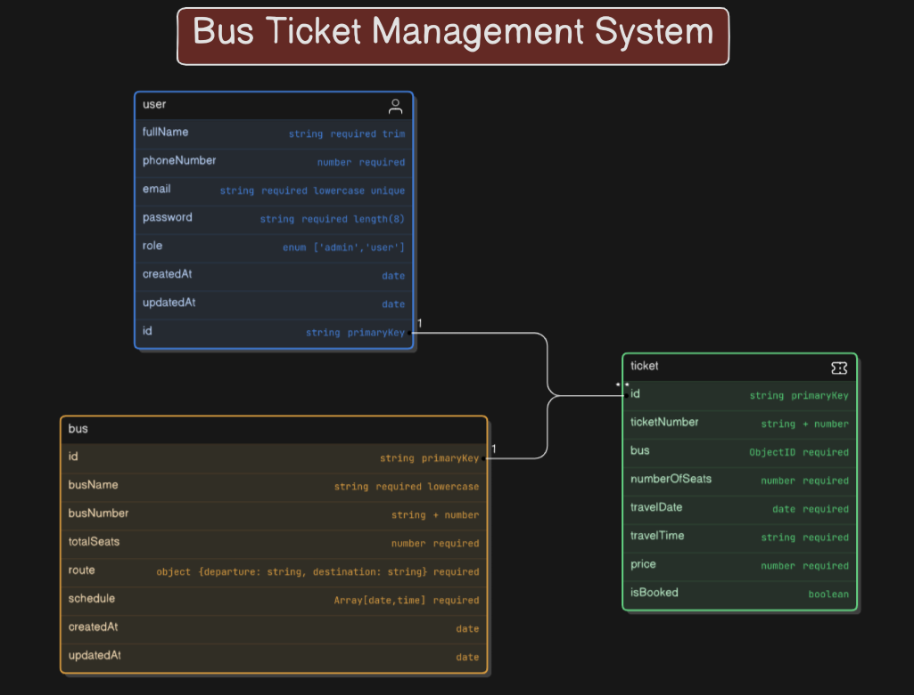

# Bus Ticket Management System

This is a bus ticket management system api. Using this api we can purchase a bus ticket in a specific time period. The core features of this api are create a bus, update a bus info, delete a bus, create a ticket, update a ticket, purchase a ticket and so on.


### Project Setup

1. Step-01: Clone the repository

```bash
git clone https://github.com/km-saifullah/bus-ticket-management-system.git
```

2. Step-02: Install the required dependencies

```bash
npm install
```

3. Step-03: Create **.env** file and copy the contents from **.env.sample** file and paste it to the **.env** file. Then replace the environment variable value.

```bash
PORT=8000
DATABASE_URL=your_mongodb_uri
TOKEN_SECRET=token_string
TOKEN_EXPIRES=token_expiration_time
```

4. Step-04: Start the development server

```bash
npm run dev
```

### API Documentation

<a href="https://documenter.getpostman.com/view/16730068/2sAYHxnib5" target="_blank">Postman Documentation</a>

### Entity Relationship Diagram



<a href="https://app.eraser.io/workspace/aJ9n2ZcZ9zroUQEgfkwN?origin=share&elements=ttzRzrT2KIr8_KcvV_YC8w" target="_blank">Full ER Diagram</a>
